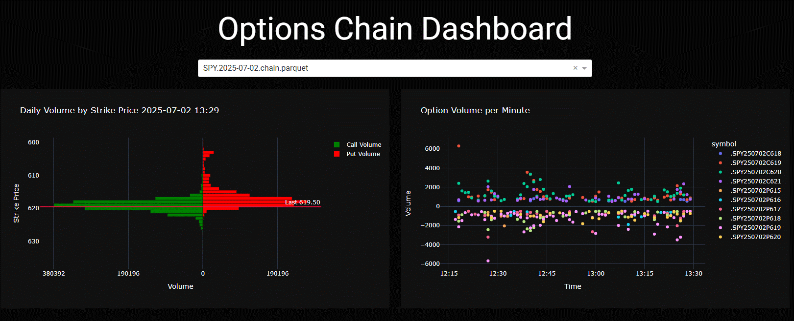

# Dashboard for 0DTE opions


Designed to read a Pandas dataframe from a Parquet file if/when that file changes.
This approach allows the web server to not need/make calls to other Internet services.

The Pandas Dataframe is a slightly trimed result of essentially the following:
```curl --no-progress-meter -X GET "https://api.tdameritrade.com/v1/marketdata/chains?apikey=${TDA_CLIENT_ID}&symbol=%24SPX.X&strikeCount=50&fromDate=$d0&toDate=$d0" -o $filename
```

|| Filename || Description |||
| polling.py | Demonstrates browser polling server to get incremental data
| react.py   | Try doing incremental updates in React

# TODOs
* The Plotly charts result in a total resend of the data. For the Pez dispenser, this is around 1mb. Ideally only the incremental data is sent. The browser can then figure out what to do after that.
* Until the incremental thing is fixd, the app uses extendable Graph, which maybe sucks.

# Daily
* Create csv for each parquet file
* gzip json file
* Concat SPX GEX files into single file

# Other Junk
Start server using ```gunicorn app:server -b :8050 --access-logfile access.log -D```

# About the Dash Store component
When used as input or state, all data is transfered to server from client. Same applies on Output.
A Client side script can manipulate the Store including setting it to Null. If set to Null in JS, Python server gets None


